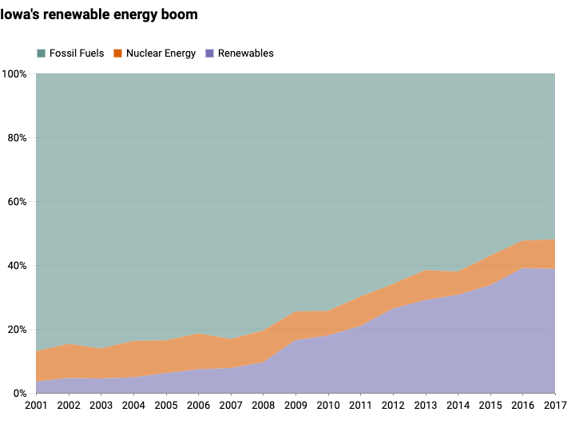

# The `Stiles` theme for Altair

Make charts **my** way using the [Altair](https://altair-viz.github.io/) charting library for Python.

### Getting started

Install [from PyPI](https://pypi.org/project/altair-stiles/).

```bash
$ pip install altair-stiles
```

Import with Altair.

```python
import altair as alt
import altair_stiles as altstiles
```

Register and enable the theme.

```python
alt.themes.register('stiles', altstiles.theme)
alt.themes.enable('stiles')
```

Make a chart.

```python
from vega_datasets import data
source = data.iowa_electricity()

alt.Chart(source, title="Iowa's renewable energy boom").mark_area().encode(
    x=alt.X(
        "year:T",
        title=" "
    ),
    y=alt.Y(
        "net_generation:Q",
        stack="normalize",
        title=" ",
        axis=alt.Axis(format=".0%", tickCount=5),
    ),
    color=alt.Color(
        "source:N",
        legend=alt.Legend(title=" "),
    )
).configure_legend(orient='top')
```



### What else?

This library requires that you have the "Roboto" font installed. 
